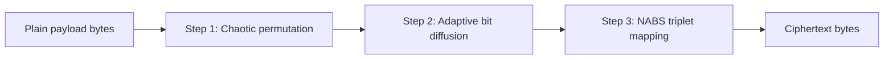
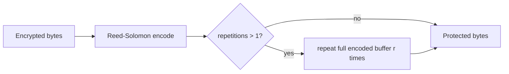
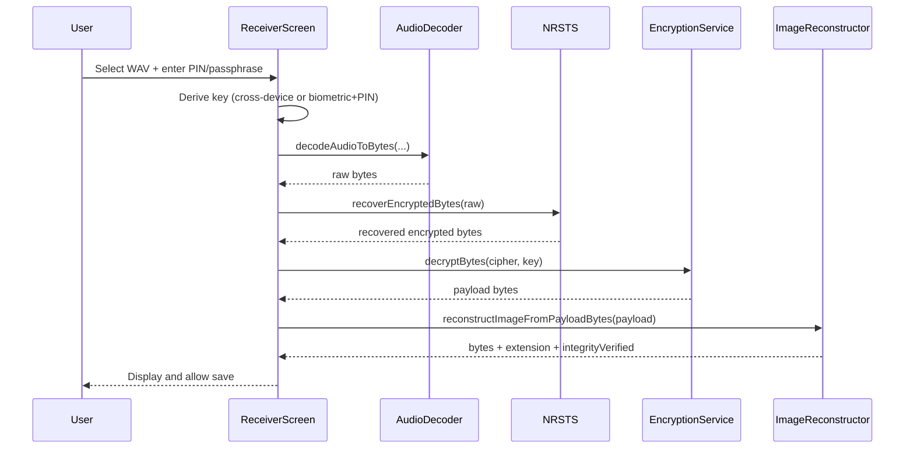

# VisioLock Encryption and Decryption Deep Dive

This document explains how encryption and decryption work in this project, from key derivation to acoustic transmission and image reconstruction.

It is written to match the current implementation in:

- `lib/services/encryption_service.dart`
- `lib/services/combined_key_service.dart`
- `lib/services/passphrase_key_service.dart`
- `lib/services/biometric_key_service.dart`
- `lib/services/noise_resistant_transmission_service.dart`
- `lib/services/error_correction_service.dart`
- `lib/services/audio_encoder.dart`
- `lib/services/audio_decoder.dart`
- `lib/services/image_processor.dart`
- `lib/services/image_reconstructor.dart`
- `lib/screens/sender_screen.dart`
- `lib/screens/receiver_screen.dart`

## 1. End-to-End Overview

The app does not encrypt pixels directly in-place. It builds a payload, encrypts payload bytes, protects those bytes with FEC/repetition, converts them to FSK audio, and performs the exact reverse process on the receiver.

```mermaid
flowchart LR
  A[Input image file] --> B[I2A3 payload framing]
  B --> C[Key derivation]
  C --> D[SAIC-ACT encryption]
  D --> E[NRSTS protection\nReed-Solomon + repetition]
  E --> F[FSK modulation to WAV]
  F --> G[WAV file transport]
  G --> H[Goertzel FSK demodulation]
  H --> I[NRSTS recovery\nsegment try + majority vote]
  I --> J[SAIC-ACT decryption]
  J --> K[I2A3 parse + SHA-256 verify]
  K --> L[Recovered image bytes]
```



## 2. Payload Framing Before Encryption (I2A3)

Before encryption, raw image bytes are wrapped in a binary container so the receiver can restore file type and verify integrity.

### 2.1 I2A3 Binary Layout

| Offset | Size | Field |
|---|---:|---|
| 0 | 4 | Magic ASCII: `I2A3` |
| 4 | 4 | Extension length (`uint32`, little-endian) |
| 8 | 4 | File length in bytes (`uint32`, little-endian) |
| 12 | 32 | SHA-256 of original image bytes |
| 44 | `extLen` | Extension bytes (for example `png`) |
| `44 + extLen` | `fileLen` | Original image bytes |

Header size is fixed at 44 bytes.

### 2.2 Why This Exists

- Makes reconstruction lossless (exact bytes, not a re-rendered approximation).
- Lets receiver verify integrity with SHA-256 after decryption.
- Supports multiple image extensions without guessing.

## 3. Key Derivation Modes

Two modes are used in sender and receiver screens.

```mermaid
flowchart TD
  A[User enters PIN/passphrase] --> B{Cross-device mode?}
  B -- Yes --> C[trim input]
  C --> D[K = SHA-256 UTF8 passphrase]
  B -- No --> E[Biometric auth required]
  E --> F[Load or create 32-byte biometric secret]
  F --> G[trim PIN]
  G --> H[K = SHA-256 biometricSecret || UTF8 PIN]
```

### 3.1 Device-Bound Mode (default)

1. User authenticates via biometrics.
2. App loads a persistent random secret (32 bytes) from secure storage key `i2a_biometric_secret_v1`.
3. If not present, app creates a new cryptographically random 32-byte secret and stores it.
4. App concatenates `biometricSecret || utf8(trim(PIN))`.
5. App computes SHA-256 over that merged buffer.
6. Resulting 32-byte digest is the encryption key.

Formula:

$$
K = \mathrm{SHA256}(B \| \mathrm{UTF8}(\mathrm{PIN_{trim}}))
$$

### 3.2 Cross-Device Mode

1. App trims input text.
2. App computes SHA-256 of UTF-8 passphrase.
3. Digest is the key on both devices.

Formula:

$$
K = \mathrm{SHA256}(\mathrm{UTF8}(\mathrm{passphrase_{trim}}))
$$

Important note: app code still names this field `pin`, but in cross-device mode it acts as passphrase input.

## 4. SAIC-ACT Encryption Algorithm

The encryption pipeline in `EncryptionService` has three layers:

1. Chaotic byte permutation
2. Adaptive bit diffusion
3. Noise-aware binary shaping (NABS)



Decryption is exact reverse order:

1. NABS (same function, self-inverse)
2. Inverse adaptive diffusion
3. Inverse permutation

### 4.1 Step 1: Chaotic Byte Permutation

Permutation index array is generated using Fisher-Yates shuffle driven by logistic map iterations.

Logistic map:

$$
x_{n+1} = r x_n (1 - x_n)
$$

Parameters are seeded from first two key bytes:

$$
x_0 = \frac{K[0]}{255} \cdot 0.8 + 0.1
$$

$$
r = 3.9 + \frac{K[1]}{255} \cdot 0.09
$$

Then for `i = n-1 ... 1`:

1. Update `x = r * x * (1 - x)`
2. Compute `j = floor(x * (i + 1))`, clamped to `[0, i]`
3. Swap permutation entries `perm[i]` and `perm[j]`

Forward permutation:

$$
out[i] = in[perm[i]]
$$

Inverse permutation:

$$
out[perm[i]] = in[i]
$$

### 4.2 Step 2: Adaptive Bit Diffusion

Diffusion works bit-by-bit, MSB first in each byte, chaining through previous ciphertext bit.

Encryption equation:

$$
C_i = P_i \oplus C_{i-1} \oplus K_i
$$

where:

- $C_{-1}=0$ (initial chain bit)
- $K_i$ is key bit at `i mod (key.length * 8)`

Decryption equation:

$$
P_i = C_i \oplus C_{i-1} \oplus K_i
$$

Implementation detail: during decryption, chain tracks input ciphertext bit (`inBit`), so the same chain state used in encryption is reconstructed.

### 4.3 Step 3: NABS (Noise-Aware Binary Shaping)

This stage transforms 3-bit groups (triplets) to reduce problematic all-zero/all-one run structures for FSK channels.

Mapping (self-inverse):

- `000 <-> 001`
- `110 <-> 111`
- other triplets unchanged

The code processes aligned 24-bit blocks (3 bytes = 8 triplets each). Any trailing 1-2 bytes are left unchanged.

Because mapping is self-inverse, same function is used in encryption and decryption.

## 5. Formal Encrypt/Decrypt Pseudocode

### 5.1 Encrypt

```text
encrypt(data, key):
  assert key not empty
  if data empty: return []

  permuted = permuteBytes(data, key, forward=true)
  diffused = adaptiveDiffuse(permuted, key, decrypt=false)
  shaped   = noiseAwareBinaryShaping(diffused)
  return shaped
```

### 5.2 Decrypt

```text
decrypt(cipher, key):
  assert key not empty
  if cipher empty: return []

  unshaped  = noiseAwareBinaryShaping(cipher)   # self-inverse
  undiffuse = adaptiveDiffuse(unshaped, key, decrypt=true)
  plain     = permuteBytes(undiffuse, key, forward=false)
  return plain
```

## 6. NRSTS Protection Layer (After Encryption)

Encrypted bytes are protected before modulation.



Default settings in app:

- `correctableSymbols = 8`
- `paritySymbols = 16`
- `codewordLength = 255`
- `dataSymbolsPerBlock = 239`
- `repetitions = 3`

That means Reed-Solomon is effectively `RS(255,239)` style block framing, then 3x repetition.

### 6.1 Recovery Strategy on Receiver

Receiver attempts the following in order:

1. Assume repeated payload (`rep = 3`) if divisible.
2. Try each segment directly through Reed-Solomon decode.
3. If all fail, majority-vote corresponding bits/bytes across segments, then decode.
4. Fallback to `rep = 1` path and retry.
5. If nothing decodes, return raw bytes and let later layers fail.

This design improves robustness but can still fail if corruption exceeds correction capability.

## 7. Audio Modulation and Demodulation

### 7.1 Encoder (BFSK)

- Sample rate: `8000 Hz`
- Bit duration: `2 ms`
- Samples per bit: `16`
- `0 -> 1500 Hz`
- `1 -> 3000 Hz`
- Mono, 16-bit PCM WAV

Each protected byte expands heavily:

- 8 bits per byte
- 16 samples per bit
- 2 bytes per sample

So:

$$
\text{wavDataBytes} = \text{protectedBytes} \times 8 \times 16 \times 2 = 256 \times \text{protectedBytes}
$$

Total WAV file size:

$$
\text{wavTotalBytes} = 44 + 256 \times \text{protectedBytes}
$$

### 7.2 Decoder

Decoder parses WAV PCM header, then for each bit-window computes Goertzel power at both target frequencies.

Decision rule:

$$
bit = \begin{cases}
1 & \text{if } P(f_1) > P(f_0) \\
0 & \text{otherwise}
\end{cases}
$$

where $f_0=1500$, $f_1=3000$ by default.

Receiver also tries legacy parameter combinations:

- legacy frequencies: `500/1200 Hz`
- legacy timing: `20 ms/bit`
- combined legacy timing + frequencies

## 8. Decryption and Reconstruction Flow in Receiver



## 9. Integrity, Correctness, and Failure Modes

### 9.1 What Confirms Correct Decryption

For current format `I2A3`, decryption is considered successful when:

1. Payload magic parses correctly (`I2A3`), and
2. Embedded SHA-256 equals SHA-256 of recovered image bytes.

If hash mismatches, receiver throws an integrity error indicating likely corruption/transcoding or wrong key.

### 9.2 Common Failure Cases

1. Wrong PIN/passphrase: decrypted bytes do not parse or hash fails.
2. Device mismatch in device-bound mode: biometric secret differs, key differs.
3. Audio transcoding (for example voice note compression): demodulation errors exceed FEC tolerance.
4. Payload too large for WAV 4 GB RIFF limit: sender retries with repetition disabled (`repetitions=1`).

### 9.3 Practical Security Notes

1. This is a custom cipher construction, not a standard AEAD mode such as AES-GCM.
2. Cross-device key derivation uses plain SHA-256(passphrase) without salt or KDF work factor, so weak passphrases are vulnerable to offline guessing.
3. Integrity check is strong for accidental corruption and wrong-key detection, but this is not equivalent to a modern authenticated encryption proof model.

## 10. Data Growth and Throughput Intuition

Let plaintext payload size be $M$ bytes.

Reed-Solomon expansion (exact):

$$
E = M + 16 \cdot \left\lceil \frac{M}{239} \right\rceil
$$

With repetition factor $r$ (default $r=3$):

$$
R = r \cdot E
$$

WAV output size:

$$
W = 44 + 256R
$$

For large payloads and default settings, total amplification is roughly:

$$
\frac{W}{M} \approx 256 \cdot 3 \cdot \left(1 + \frac{16}{239}\right) \approx 819.4
$$

This very high expansion is expected for robust acoustic transport.

## 11. Quick Verification Checklist

Use this when validating sender/receiver interoperability.

1. Sender and receiver use same key mode (cross-device toggle matches).
2. Sender and receiver use same PIN/passphrase.
3. Export/import original WAV file as document/file (not re-recorded, not transcoded).
4. Receiver shows successful reconstruction and, for modern payloads, `integrityVerified = true`.

## 12. Developer Cross-Reference

Main methods involved:

- `ImageProcessor.convertImageToBinary`
- `PassphraseKeyService.deriveKey`
- `BiometricKeyService.getOrCreateBiometricKey`
- `CombinedKeyService.deriveCombinedKey`
- `EncryptionService.encryptBytes`
- `NoiseResistantTransmissionService.protectEncryptedBytes`
- `AudioEncoder.encodeBytesToAudioFile`
- `AudioDecoder.decodeAudioToBytes`
- `NoiseResistantTransmissionService.recoverEncryptedBytes`
- `EncryptionService.decryptBytes`
- `ImageReconstructor.reconstructImageFromPayloadBytes`

This is the full encrypt/decrypt chain used by the app today.
